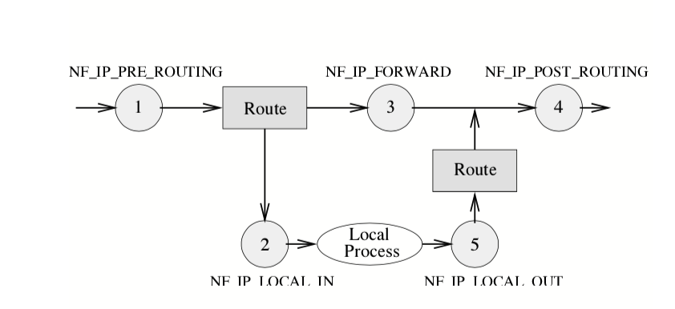
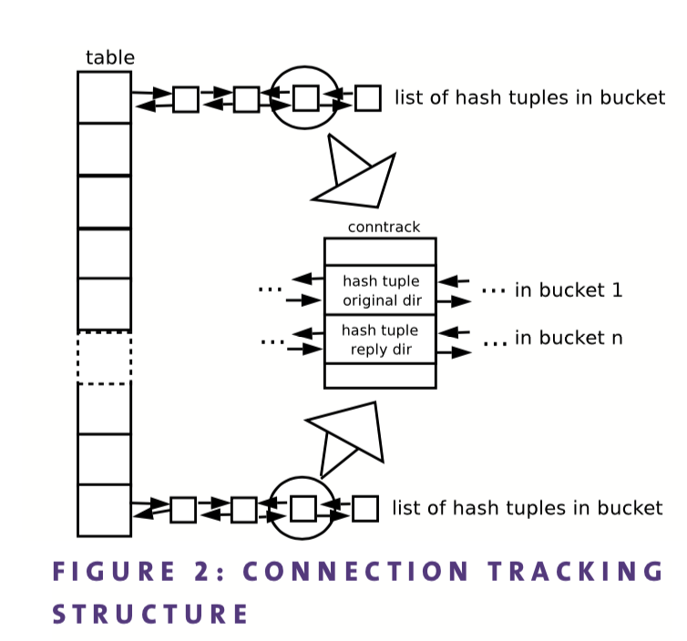
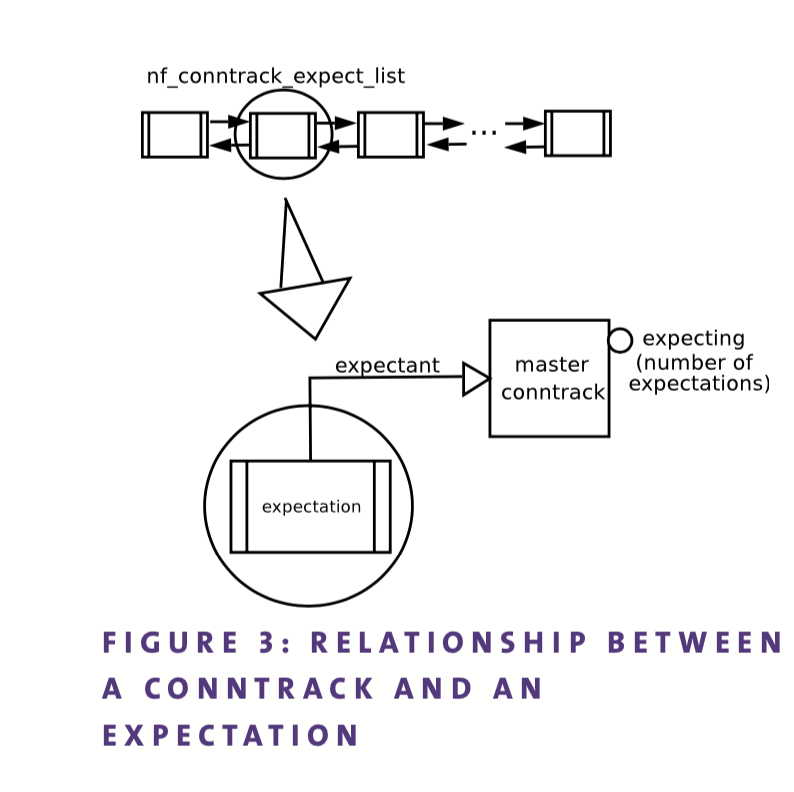

基于包头的唯一过滤方式已经过时了，现在，有状态的防火墙为系统管理员和安全专家提供更丰富更智能的策略。
这篇文章介绍了介绍了连接跟踪系统的实现原理，并且提供了理解该系统所需要的背景，例如了解`Netfilter`框架。
在最近的`Linux`内核，只要使用了有状态的防火墙，本文都能够很好的进行解释。

# Netfilter框架

在linux内核2.3.x开发期间，`Paul Rusty`开发了`Netfilter`项目，当时，现存的`Linux`防火墙存在严重的缺陷，需要重写。
Rusty决定从零开始写一个`Netfilter`框架，它包括了一些钩子点，这些钩子点贯穿了整个`Linux`网络协议栈。
在这些钩子点中，你可以注册任何的内核模块，在不同阶段来做一些数据包的操作.

`Iptables`，`Linux`中最流行的防火墙工具，通常会和`Netfilter`框架相互混淆。这是因为`Iptables`链和钩子点具有相同的名字。但是`Iptables`仅仅是`Netfilter`框架上的一块砖。

幸运的是，`Rusty`花了相当多的时间来写文档，这对于任何想了解这个框架人都极其方便。尽管在某些时候，你肯定觉得有必要亲自动手查看代码来进一步了解它。

## 钩子点和回调函数

连接跟踪在`Linux`网络协议栈中插入了五个钩子点，用来在不同阶段来处理数据包。这些分别是：

* PREROUTING: 所有的包无一例外都需要命中这个钩子，这个钩子基于查找路由之前，在IP头安全性检查之后。端口地址转换（NATP）和重定向，地址转换（DNAT）都在这个钩子实现。
* LOCAL INPUT：所有的包都会通过这个钩子到达本地协议栈。这是本地流量收路径的最后一个钩子。
* FORWARD：不进入本机的包到达这个钩子（例如穿越防火墙的包）。
* LOCAL OUTPUT：这是外出包离开本机的第一个钩子。所有的外出报文都会命中这个钩子
* POSTROUTING： 这个钩子是路由决策之后实现。原地址转换（SNAT）会被注册到这个钩子。所有离开本地的钩子都会命中这个钩子。

因此，根据目的地址的不一样，我们可以建模三种类型的流量。
* 流经防火墙的流量，换句话说，就是转发流量，不经过本地的流量。这种流量流经的路径是：`PREROUTING FORWARD POSTROUTING`。
* 流入防火墙的流量，流入本机的流量，该种流量的路径是：`PREROUTING INPUT`
* 流出防火墙的流量：`OUTPUT POSTROUTING`。

每个人都可以在指定的钩子上注册回调。回调函数的原型定义在`netfilter.h`中的`nf_hook_ops`结构体中。这个结构包含了回调函数要注册的钩子信息和优先级。因为可以注册不止一个回调到钩子，这个优先级表明了回调函数的处理顺序。注册函数使用`nf_register_hook()`.

回调可以返回几种不同的值，这些值在框架中解释如下：
ACCEPT：放通数据包，可以继续走协议栈
DROP：立即丢弃该数据包
QUEUE：通过nf_queuqe工具函数传递到用户空间，让用户程序可以处理这个数据包。
STOLEN：静默的hold住该数据包，直到触发某些事件。这个是为了临时让某些数据包不继续穿越协议栈。这个通常用来收集分片包文。
REPEAT：强制重新进入这个钩子点。

简而言之，该框架提提供了一种让各种回调注册的方法，这些回调可以干各种事情来处理数据包。返回值也会被框架根据策略来处理

如果此刻你还不够清晰或者需要了解跟多有关协议栈的信息，参考下面文档2.

## 连接跟踪系统和状态探查

基于包头（如IP源，目的地址，端口）过滤策略的时代已经结束了，多年来，这种方法被证明不足以防范恶意侦测和ddos攻击。

幸运的是，当今系统管理员可以在他们的防火墙中执行状态过滤，有很多开源实现运用在生产环境中。比如Linux，这个特性是在`Netfilter`诞生之日就被加入了。连接跟踪是`Netfilter`框架之上的另一块砖。

通常来说，连接跟踪系统在内存中存储连接的状态信息，比如IP 源和目的地址，端口，协议，状态和超时时间。还有一些额外的信息，我们能构建更智能过滤策略。

此外，有一些应用层协议，比如FTP，TFTP，IRC和PPTP，这些在传统的防火墙中难以跟踪的协议都可以在连接跟踪系统中处理。

连接跟踪系统本身不过滤任何报文，默认的动作总是让报文通过协议栈，尽管有一些数据包可能被丢弃的特例（比如内存耗尽）。所以牢牢记住连接跟踪仅仅用来跟踪包的，而不是过滤器。

### 状态

一条连接可能的状态如下：

* NEW：连接正在启动，如果包是有效的，也就是说，如果它属于一个有效的初始化序列（例如，在tcp连接中，接收到一个SYN包），防火墙中只看到一个方向的流量（防火墙还没有任何返回方向的包），那么就会到达这个状态。
* ESTABLISHED： 连接已经被建立了。换句话说，当防火墙看见了两个方向的通信，就会达到这个状态。
* RELEATED：这是一个期望连接。这个会在Helpers和期望连接一节解释。
* INVALID：这是一个特殊的状态表示收到了一个不遵循连接预期的包，管理员可以选择在iptables中定义规则来记录或者删除这个包。就如前面说过，连接跟踪本身不过滤掉包，而且提供一种过滤包的方法。

 也许你已经注意到了，即使是无状态协议比如UDP也是有状态的，当然这些状态是和TCP的状态无关的。
 
#### 更大的视图
 
 本文主要关注3层独立的连接跟踪系统，这个是基于IPV4的，在Linux内核2.6.15就一直被使用。针对连接跟踪系统对IPV4和IPV6的支持分别由`nf_conntrack_ipv4`和`nf_conntrack_ipv6`实现。
 
 
 
 4层协议的支持也是在独立的模块中实现的。目前，有一个内建TCP，UDP，ICMP支持，可选的支持比如SCTP。
 
 模块`nf_conntrack_ipv4`在几个钩子点注册了四个回调。这些回调在文件`nf_conntrack_core.c`中，以三层协议号作为参数，因此基本上和IPV4没有区别。这些回调可以分为三类：
 
 1. 连接跟踪的创建和查找
 2. 分片包文跟踪
 3. Helpers。
 IPV6模块`nf_conntrack_ipv6`不会在本文中深入了，因为和IPV4很像。
 
### 实现问题
 
#### 基本结构
 
 连接跟踪系统是一个可选的模块化子系统。尽管他是NAT子系统所要求的。它通过一个hash表来执行高效的查询。每个桶都有一个双链表的`hash tuple`。每条连接都有两个hash tuples。一个是请求方向（请求报文建立连接的方向），一个是应答方向。
 
 一个`tuple`表示一条连接的信息。IP源和目的地址，还有四层协议信息。这个`tuple`是嵌在一个`hash tuple`中的。
 两个结构都定义在`nf_conntrack_tuple.h`中。
 
 这两个`hash tuple`都嵌入在`nf_conn`结构体中，从这一点开始，我们将其称为conntrack，它是存储给定连接状态的结构。因此，conntrack是两个`hash tuple`的容器，而每个`hash tuple`都是一个`tuple`的容器。这导致了三层嵌入式结构。
 
哈希函数用于计算表示连接的哈希元组的位置。该计算将相关的第3层和第4层协议信息作为输入参数。目前使用的函数是Jenkins的hash(jhash).

哈希计算使用随机种子进行扩展，以避免在某些恶意用户对给定的哈希链进行哈希炸弹攻击时可能出现的性能下降，因为这可能导致非常长的哈希tuple链。然而，连接表具有有限的最大连接数;如果它被填满，那么被驱逐的conntrack将是最近最少使用的散列链。conntrack表的大小可以在模块加载时进行调优，也可以在内核引导时进行调优。
 
#### 连接跟踪创建和查找过程

回调函数`nf_conntrack_in`在PREROUTING钩子中注册。在此阶段将进行一些完整性检查，以确保包是正确的。然后，在conntrack查找过程中进行检查。子系统试图查找与接收到的包匹配的conntrack。如果没有找到conntrack，将创建它。该机制在函数`resolve_normal_ct`中实现。

如果数据包属于一个新连接，则刚刚创建的conntrack将confirmed 标志未设置状态。如果已经在散列表中已经存在该conntrack，confirm标志是被设置的。这个标志表示连接插入的情况。插入的动作将在包成功离开框架后发生（当它到达最后一个钩子而没有被丢弃时)。包和连接之间的关联是通过指针来建立的。如果指针为空，则数据包属于一个无效连接。Iptables还允许某些包不使用连接跟踪。为此，使用了一个虚拟的`nf_conntrack_untracked`。

总之，回调`nf_conntrack_confirm`注册在`LOCAL INPUT`和`POSTROUTING`钩子中。正如您已经注意到的，这是本地流量和转发流量退出路径中的最后一个钩子（就是盒子的发送端）。确认过程此时发生:将连接跟踪插入哈希表，设置了`confirmed`的标志，并激活了关联的计时器。

#### 重组分片包处理

这项工作由回调`ipv4_conntrack_defrag`完成，它收集分片数据包。一旦成功接收到完整报文，就会继续在协议栈传递。

在2.4内核分支中，分片包被线性化，也就是说，它们被复制到连续内存中。但是，在内核分支2.6中引入了一个优化，减少这种额外处理成本的影响，分片不再复制到线性空间中，相反，它们被收集起来并放入一个链表。因此，所有处理都必须是分片感知的。例如，如果我们需要一些信息存储在TCP包头部，我们必须首先检查头部是否被分片;如果是，那么只需将所需的信息复制到协议栈中。这实际上不是一个问题，因为有易于使用的函数，如`skb_header_pointer`，它们是分片感知的，并且可以在分片重组时，线性化抽出所需的头部信息。这种头部检查不会招致任何性能惩罚。

#### HELPERS和期望连接

一些应用层协议具有某些难以跟踪的方面。例如，文件传输协议(FTP)被动模式使用端口21进行控制操作从服务器请求一些数据，但是它使用1024到65535之间的TCP端口接收请求的数据，而不是使用传统的TCP端口20。这意味着这两个独立的连接是内在相关的。因此，防火墙需要额外的信息来成功过滤这类协议。

连接跟踪系统定义了一种称为`helper`的机制，该机制允许系统识别连接是否与现有连接相关。为此，它定义了期望连接的概念。期望连接是预期在一段时间内发生的联系。它被定义为`nf_conntrack_core.h`文件中的`nf_conntrack_expect`结构。

helper在包含难以跟踪的方面的包中搜索一组模式。在FTP的情况下，Helper会查找端口模式，该端口是应答方向中被动模式连接的请求而发送的(即， PASV方法)。如果匹配到端口，就会创建一个期望，并将其插入到期望的全局列表中(图3)。因此，helper定义了下一阶段的可能连接的模式（匹配信息）。

期望连接的生命是有限的。一般创建了新连接，连接跟踪系统将搜索匹配的期望连接。如果找不到匹配项，它将为该连接寻找Helper程序。

当系统找到匹配的期望连接时，新的连接会被关联到创建该期望连接的主连接。例如,FTP的被动模式,连接到21端口的连接跟踪是主连接，表示数据流量连接跟踪会关联到这条连接。

helper通过`nf_contrack_helper_register`注册，它将一个结构`nf_conntrack_helper`添加到一个helper列表中。

Netfilter的连接跟踪系统并不是一成不变的软件。有相当多的有趣的工作正在进行中，旨在改进现有实现。值得一提的是，在第四届Netfilter研讨会[4]中，提出了用一棵哈希表树[5]替换当前哈希表方法的一些工作。初步性能测试看起来很有前途。

幸运的是，本文描述的子系统不仅可以从内核里面访问。存在一个名为`libnetfilter_conntrack`的用户空间库，它为内核内连接跟踪状态表提供了一个编程接口(API)。

至于Helper，支持互联网电话协议，如H.323和VoIP正在进行中。此外，也有一些工作正在进行中, 是关于提供适当的机制以允许人们在用户空间中实现自己的协议Helper方面，这是Rusty在Netfilter项目早期的梦想。